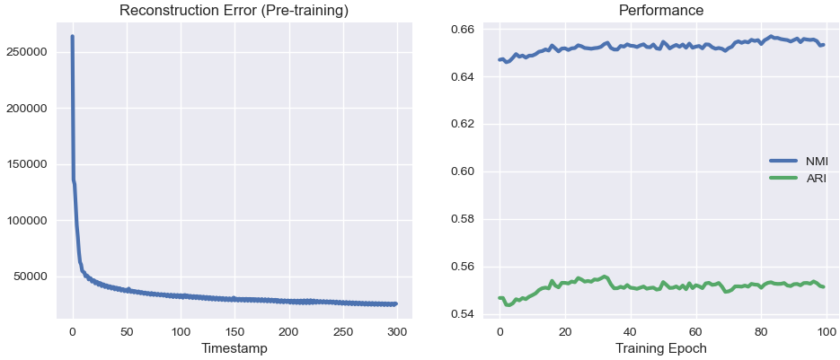

### DCN: Deep Clustering Network

Forked from xuyxu (https://github.com/xuyxu/Deep-Clustering-Network)

### Results


| NMI | ARI | parameters |
|-----|-----|------------|
| 0.841 | 0.747 | mnist.py --latent-dim 10 --epoch 50 --pre-epoch 50 --lamda 0.005 --lr 0.002 |
| 0.800 | 0.689 | mnist.py --latent-dim 10 --epoch 50 --pre-epoch 50 --lamda 0.005 --lr 0.001 |
| 0.800 | 0.684| mnist.py --latent-dim 10 --epoch 50 --pre-epoch 50 --lamda 0.004 --lr 0.001 |
| 0.793 | 0.676 | mnist.py --latent-dim 10 --epoch 50 --pre-epoch 50 --lamda 0.01 --lr 0.001 |
| 0.758 | 0.647 | mnist.py --latent-dim 10 --epoch 50 --pre-epoch 50 --lamda 0.05 --lr 0.001|
| 0.748 | 0.629 | mnist.py --latent-dim 10 --epoch 50 --pre-epoch 50 --lamda 0.05 |
| 0.737 | 0.618 | mnist.py --latent-dim 10 --epoch 50 --pre-epoch 50 --lamda 0.05 --lr 0.0001|
| 0.737 | 0.595 | mnist.py --latent-dim 10 --epoch 50 --pre-epoch 50 --lamda 0.05 --lr 0.0005 |
| 0.701 | 0.581 | mnist.py --latent-dim 10 --epoch 50 --pre-epoch 50 |
| 0.661 | 0.472 | mnist.py --latent-dim 10 --epoch 50 --pre-epoch 50 --lamda 0.001 --lr 0.001 | 
| 0.627 | 0.412 | mnist.py --latent-dim 10 --epoch 50 --pre-epoch 50 --lamda 0.05 --lr 0.005 | 
| 0.678 | 0.526 | mnist.py --latent-dim 10 --epoch 50 --pre-epoch 50 --lamda 0.1 --lr 0.001|
| 0.536 | 0.205| mnist.py --latent-dim 3 --epoch 50 --pre-epoch 50 --lamda 0.005 --lr 0.001 | 
|-----|-----|------------|
|0.81|0.73| *original paper claim:* pre-/eps 50, lamda 0.05, 4-layer 500-500-2000-10|


Readme from another repo: https://github.com/xuyxu/Deep-Clustering-Network/blob/master/README.md
### DCN: Deep Clustering Network
I found the official implementation of deep clustering network (DCN) is outdated (https://github.com/boyangumn/DCN-New). This repo is a re-implementation of DCN using PyTorch.

#### Introduction
An interesting work that jointly performs unsupervised dimension reduction and clustering using a neural network autoencoder.

#### How to run
Here I offer a demo on training DCN on the MNIST dataset (corresponding to Section 5.2.5 in the raw paper). To run this demo, simply type the following command:

```
python mnist.py
```

#### Acknowledgement
For anyone with interests, you can also refer to the implementation of Günther Eder: https://github.com/guenthereder/Deep-Clustering-Network, which has more details on the reproducibility.

#### Experiment
I trained the DCN model on MNIST dataset, hyper-parameters like network structure were set as values reported in the paper. The left figure presents the reconstruction error of the autoencoder during the pre-training stage, and the right figure presents changes on NMI and ARI (two metrics employed in the paper) during the training stage. The best NMI result I have got is around 0.65.



#### Package dependency
* scikit-lean==0.23.1
* pytorch==1.6.0
* torchvision==0.7.0
* joblib==0.16.0

In my practice, this implementation also works fine on PyTorch 0.4.1. Feel free to open an issue if there were incompatibility problems.

#### Reference
* Yang et al. ''Towards K-means-friendly Spaces: Simultaneous Deep Learning and Clustering'', ICML-2017 (https://arxiv.org/pdf/1610.04794.pdf)
